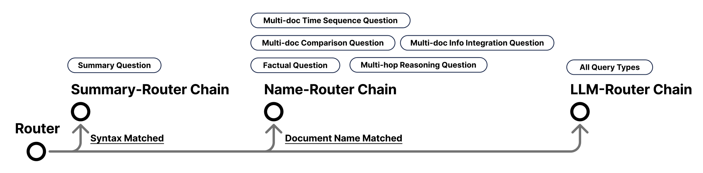
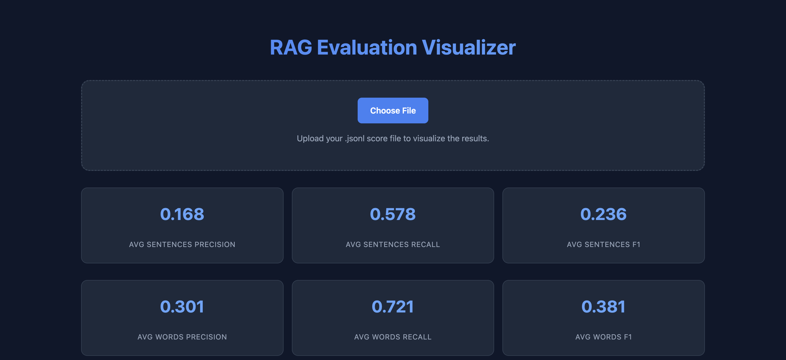

# WSM Final Project - Build A RAG System
## Project Overview
This is the final project of Web Search and Mining class in NCCU, Fall 2025.
For this project, our task is to build a **RAG system to answer the queries based on the documents**.

### Dataset
Our dataset is from [RAGEval](https://github.com/OpenBMB/RAGEval). These datasets are used to evaluate the performance of our RAG system. 
- two languages: 
    - English(en)
    - Chinese(zh)
- three types of documents: 
    - Finance
    - Medical
    - Law
- seven types of queries for each language: 
    - Summary Question
    - Factual Question
    - Multi-document Information Integration Question
    - Multi-document Comparsion Question
    - Multi-document Time Sequence Question
    - Multi-hop Resoning Question
    - Irrelevant Unsolvable Question

### Constraint
- We need to use [Ollama](https://ollama.com/) as the model provider.
- For the model, we can only use [granite4:3b](https://ollama.com/library/granite4:3b) in the local environment (without internet connection).
- For dense retrival, we can use [embeddinggemma:300m](https://ollama.com/library/embeddinggemma:300m) and [qwen3-embedding:0.6b](https://ollama.com/library/qwen3-embedding:0.6b).
- For reranking, we can use [BAAI/bge-reranker-v2-m3](https://ollama.com/qllama/bge-reranker-v2-m3).

## How to Run
1. Build the system environment
- (**Recommended**) use docker
    ```bash
    ./build.sh
    ```
- use local environment and pull the model from ollama (TBD)
    ```bash
    pip install -r requirements.txt
    ...
    ```
2. Run the system then evaluation results. Refer to [Run for the Results](#run-for-the-results).


## System Implementation
Here are the details of our system implementation.
### System Design
#### System Architecture


<!--  -->

Entry point of the system is `My_RAG/main.py`.
- We utilize Router to route each of the query to the appropriate chain.
- We mainly set on three chains:
    - `Summary Router Chain`: We handle the summary question here.
    - `Name Router Chain`: From our observation, we find that most of the queries contain the exact name of the document, so we handle this case here.
    - `LLM Router Chain`: For the rest of the queries without explicit name of the document, we handle them here.

Details of this work can be found in our slides [Slides](./docs/slides.pdf), and the final report [Report](./docs/report.pdf).

## Run for the Results
### Stage 1: Run the System
For running the system, we have the script `run.sh`:
- The `run.sh` script performs the following tasks:
    1. Runs inference using `My_RAG/main.py` for a given language and generate output files.
    2. Validates the output format using `check_output_format.py`.
    3. Logs every step with timestamps for easier debugging.
    After running the script, the output files will be generated in the `predictions` directory as `./predictions/predictions_en.jsonl` and `./predictions/predictions_zh.jsonl`.

### Stage 2: Evaluation
<!-- For evaluation, we have the script `run_evaluation.sh`: -->
- Stage 2:
    Then use the jsonl file generated from stage 1 as input to run the evaluation script.
    ```bash
        python rageval/evaluation/main.py \
        --language en \
        --input_file ./predictions/predictions_en.jsonl \
        --output ./predictions/predictions_en_score.jsonl
    ```
    ```bash
        python rageval/evaluation/main.py \
        --language zh \
        --input_file ./predictions/predictions_zh.jsonl \
        --output ./predictions/predictions_zh_score.jsonl
    ```
    After running the script above, the output files will be generated in the `predictions` directory as `./predictions/predictions_en_score.jsonl` and `./predictions/predictions_zh_score.jsonl`.
- Visualize the Results(One of Our Implementation)
    After running the evaluation script and get the score files, we can use the visualization page from our system, to visualize the results.
    - Use the web browser to open `visualization_tool\index.html` or `visualization_tool\index-zh.html`, upload the score file to visualize the results.
    <!--  -->
    <!--  -->

## Acknowledgement
- We refer to the [RAGEval](https://github.com/OpenBMB/RAGEval) for the dataset and evaluation.
- For dense retrival, we refer to the [FAISS](https://github.com/facebookresearch/faiss) for the implementation.
